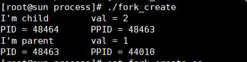
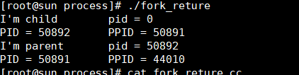

# 进程的创建（fork)

一个现有的进程可以通过fork创建新的进程，如果fork函数执行失败将返回-1.由fork创建出来的进程为子进程，那么之前那个进程就是父进程了，我们先执行一个程序在讨论内容；

**代码**

```c
//fork_create.cc
#include <unistd.h>
#include <stdio.h>
#include <stdlib.h>

#define ERR(msg) do{perror(msg);exit(0);} while(0)

int main()
{
    int val = 1;
    pid_t pid;

    pid = fork();

    if(pid < 0)
	ERR("fork error");
    else if(pid == 0) //子进程
    {
	val++;
	printf("I'm child\t val = %d\n",val);
	printf("PID = %d \t PPID = %d\n",getpid(),getppid());
       exit(0);
    }else if(pid > 0)//父进程
    {
	sleep(1);
	printf("I'm parent\t val = %d\n",val);
	printf("PID = %d \t PPID = %d\n",getpid(),getppid());
    }
}


```


**编译**
>gcc fork_create.cc -o fork_create

**执行**
>./fork_create 

**结果**



由上图可以看到，子进程的PPID=48463等于父进程的PID=48463，子进程的val值和父进程的val不同，这说明了val值不共享。这是由于子进程是父进程的一个副本，当父进程执行fork后，子进程获得父进程的数据空间，堆和栈的副本。就相当于复制了一份给子进程，父进程和子进程只共享正文段，即程序代码。这是由于正文段是不可修改部分。到这里也就明白了为什么父进程的val值不为2,

## fork的返回值
刚刚上面说在fork执行出错时返回值为0，但是在fork执行成功时，实际fork执行了两次，一次是父进程执行的，一次是子进程执行的。他们的返回值是不同的。

**代码**
```c
//fork_return.cc
#include <unistd.h>
#include <stdio.h>
#include <stdlib.h>

#define ERR(msg) do{perror(msg);exit(0);} while(0)

int main()
{
    int val = 1;
    pid_t pid;

    pid = fork();

    if(pid < 0)
	ERR("fork error");
    else if(pid == 0) //子进程
    {
	val++;
	printf("I'm child\t pid = %d\n",pid);
	printf("PID = %d \t PPID = %d\n",getpid(),getppid());
       exit(0);
    }else if(pid > 0)//父进程
    {
	sleep(1);
	printf("I'm parent\t pid = %d\n",pid);
	printf("PID = %d \t PPID = %d\n",getpid(),getppid());
    }
}
```

**结果**



**分析**

我们看到子进程的执行fork后的返回值为0，父进程执行fork后返回值等于子进程的PID，这是因为一个进程只有一个父进程，子进程可以通过getppid函数就可以获得父进程PID，但是一个父进程可有有多个子进程。为了区别这些子进程，所以在父进程执行fork后，会返回子进程的PID。

在上面两个程序中，我们都是在程序执行时，我们都是先让父进程睡眠1s，因为我们不知道当父进程执行fork函数后，父进程和子进程哪个先执行是不确定的。这个需要根据系统的调用策略。所以我们先让父进程主动挂起。这里1s不一定能够保证子进程先执行。

## 总结

1. 学会利用fork函数创建子进程
2. fork函数返回值为什么不同
3. 父进程中fork返回值的含义