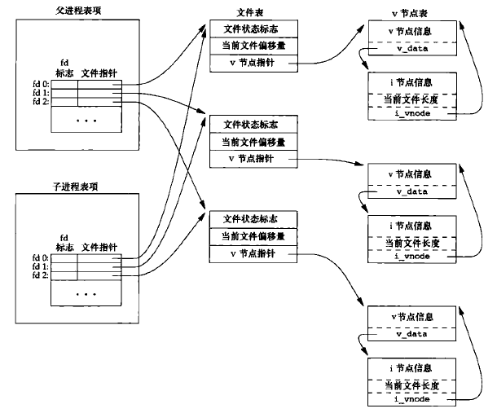
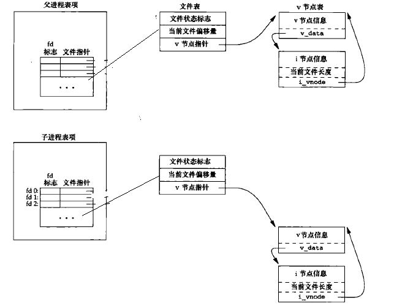

# fork和文件共享

fork的一个特征就是在fork函数调用之前打开的的文件描述符都会复制到子进程中。父进程和子进程每个相同的描述符共享一个文件表项，下面是一个拥有标准输入标准输出标准错误的进程通过fork创建一个子进程的文件描述符的示意图，接下来我将通过代码验证：



**代码**
```c
//fork_share.cc
#include <unistd.h>
#include <stdio.h>
#include <fcntl.h>
#include <stdlib.h>

#define ERR(msg) do{perror(msg);exit(0);}while(0)
int main()
{
    int fd;
    pid_t pid;
    int pos;//文件偏移量

    fd = open("1.txt",O_CREAT|O_RDWR);
    
    pos = lseek(fd,10,SEEK_SET);//首先文件偏移量设置10
    printf("before fork pos = %d \n",pos);

    pid = fork();
   
    if(pid < 0)
	ERR("fork error");

    if(pid == 0) //子进程
    {
	pos = lseek(fd,100,SEEK_CUR);
	printf("child pos = %d\n",pos);
	exit(0);
    }else if(pid > 0)//父进程
    {
	sleep(1);
	pos = lseek(fd,100,SEEK_CUR);
	printf("parent pos = %d \n",pos);
	exit(0);
    }

}
```

**输出**
>before fork pos = 10 
child pos = 110
parent pos = 210

**分析**

只要我们知道是在fork函数调用之前打开的的文件描述符都会复制到子进程中。父进程和子进程每个相同的描述符共享一个文件表项这个特征，上面的输出结果就很容易明白。首先父进程在fork之前，将文件偏移量设置10，fork之后，子进程和父进程共享打开的文件表项，子进程执行在当前位置继续偏移100，所以子进程输出为110，等待子进程退出，父进程又继续在当前位置偏移100，又有此刻位置为110，所以父进程输出为210.

## 忽视的地方

上面讲的文件共享只是发生在父进程调用fork函数之前，父进程拥有的文件描述符，但是，当父进程调用fork，父进程打开的文件描述符就不在共享，这也很容易明白。fork之前，子进程拥有父进程数据段、栈、堆的副本，fork之后，他们就在不同的环境了，

下面的代码我们让父进程在创建完子进程后在打开文件，父进程和子进程设置文件偏移量，然后查看结果：

**代码**
```c
#include <unistd.h>
#include <stdio.h>
#include <fcntl.h>
#include <stdlib.h>

#define ERR(msg) do{perror(msg);exit(0);}while(0)
int main()
{
    int fd;
    pid_t pid;
    int pos;//文件偏移量    

    pid = fork();
   
    if(pid < 0)
	ERR("fork error");

    if(pid == 0) //子进程
    {
	sleep(1);//让父进程先打开文件
	fd = open("1.txt",O_RDWR);
	pos = lseek(fd,10,SEEK_CUR);
	printf("child pos = %d\n",pos);
	exit(0);
    }else if(pid > 0)//父进程
    {
	fd = open("1.txt",O_RDWR);
	pos = lseek(fd,100,SEEK_CUR);
	printf("parent pos = %d \n",pos);
	sleep(3);
	exit(0);
    }

}
```

**结果**
>parent pos = 100 
child pos = 10

上面的结果我就不仔细分析了，大家可以对照下面图进行思考具体原因；



## vfork函数

这里直接提一下，之前说父进程调用了fork函数后，父进程和子进程不知道谁会先执行，但是，如果使用vfork函数调用，子进程会先执行，然后进入调度策略。

## 总结

1. 回忆dup函数是在一个进程中复制文件描述符
2. fork有文件共享的关系