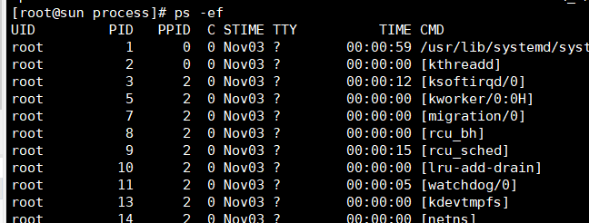

# 走进进程

什么是进程，从理论角度来说，一个具有一定独立功能的程序关于某个数据集合的一次运行活动，是系统进行资源分配和调度运行的基本单位；要是不理解也直接忽略，等到以后接触多了就理解了。
## 进程标识

每个进程都有自己的标识ID，就像我们每个人的身份证号。在很多系统中，使用延迟复用算法。赋予新的进程的ID不同于最近终止进程的ID，这样好处可以防止新的进程被认为被已经终止了。除了ID为1和2的进程之外，其他每个进程都有一个父进程，使用命令``ps -ef``查看进程的相关信息



PID(process id)进程的ID，PPID（parent process Id)，父进程的id.（这里没有PID为0的进程，可能其他系统有不一样的显示）
## 实践

可以通过getpid()和getppid()获得进程的PID和PPID，

**代码**
```c
//pid.cc
#include <unistd.h>
#include <stdio.h>

int main()
{
    printf("my PID = %d\n",getpid());
    printf("my PPID = %d \n",getppid());
}
```
**编译**
>gcc pid.cc -o pid

**执行**
>./pid

**结果**
>my PID = 45313
>my PPID = 44010

## 总结

在这一章节，我们第一次接触进程概念，掌握进程的pid和ppid的意思和如何获取；


