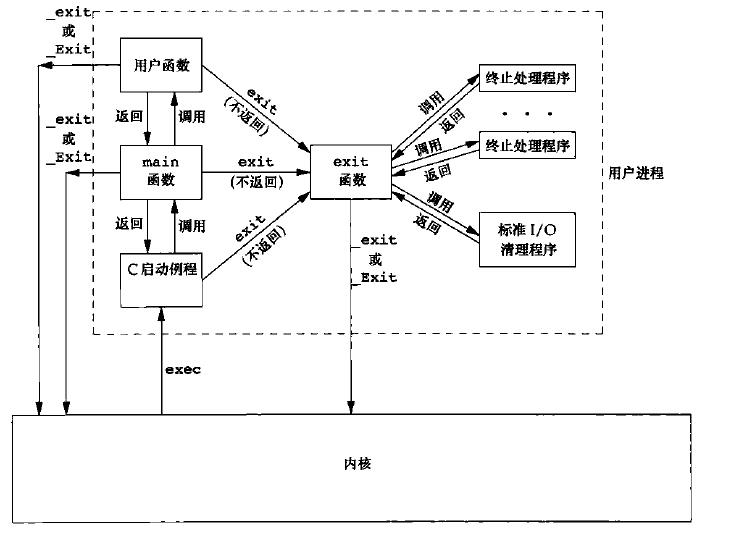
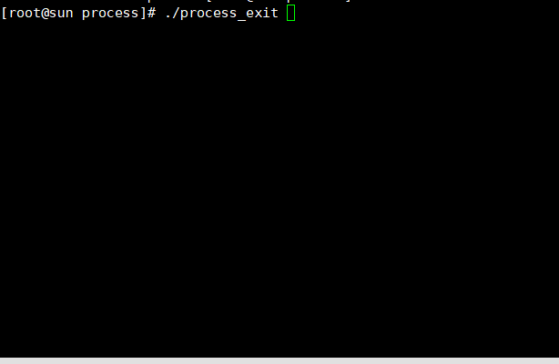
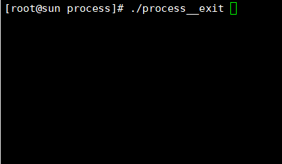

# 进程的退出（exit)

进程退出有5种正常退出和3中异常退出

5种正常退出
>1. main函数返回，实际上等效于调用exit
>2. exit函数。exit函数实际上是ISO C定义的函数，在前面也有过详细的工作流程描述
>3. 调用_exit和_Exit函数。两者可以当做等价，只是一个是ISO C库函数，一个是Unix系统函数
>4. 进程的最后一个线程执行return语句
>5. 进程的最后一个函数使用pthread_exit函数

3种异常退出
>1. 调用abort函数产生SIGABRT信号
>2. 进程接收到信号
>3. 进程接收到取消请求

我们在这一节主要讲5种正常退出，3种异常退出将放到信号那里再讲；下图是一个c程序的启动和终止：



一个c程序通过启动例程调用main函数，执行业务之后调用exit函数进行退出。从进程的状态来表示，即从running态到stopped态；

## exit函数
exit函数和_exit函数的不同在于exit的函数被调用后，进程首先会看有没有终止执行程序需要调用和调用标准I/O程序刷新缓冲区。而_exit函数是直接返回，不去调用其他终止程序。我们首先写一个exit函数的例子。来说明程序调用了标准I/O程序。

**代码**

```c
#include <unistd.h>
#include <stdio.h>
#include <stdlib.h>

#define ERR(msg) do{perror(msg);exit(0);}while(0)
int main()
{
    pid_t pid;
    
    pid  = fork();
    if(pid < 0)
	ERR("fork error");
    
    if(pid == 0)//子进程
    {
	printf("I'm child     ");//未加换行符，防止刷新缓冲区
	exit(0);
    }
    if (pid > 0) //父进程
    {
	sleep(2);
	printf("I'm parent ");
    }
}

```

**结果**

 

如果我们讲exit函数调用改为_exit，结果又是另一种现象如下图：

**代码**
```c
#include <unistd.h>
#include <stdio.h>
#include <stdlib.h>

#define ERR(msg) do{perror(msg);exit(0);}while(0)
int main()
{
    pid_t pid;
    
    pid  = fork();
    if(pid < 0)
	ERR("fork error");
    
    if(pid == 0)//子进程
    {
	printf("I'm child     ");//未加换行符，防止刷新缓冲区
	_exit(0);  //这里不同
    }
    if (pid > 0) //父进程
    {
	sleep(2);
	printf("I'm parent ");
    }
}

```

**结果**



对上面的结果是不是很差异，不相信，自己可以动手敲一遍代码执行一下。第一张图是由于子进程调用了exit函数，exit函数在退出之前，会调用标准I/O清理程序，将缓冲区的数据刷新到标准输出。第二张图是由于调用_exit函数后，进程直接退出，缓冲区的数据没有被清除，等到父进程执行时，由于缓冲区数据每人认领。系统直接丢弃。父进程的数据为什么打印出来了呢，这是由于main函数最后默认调用了exit函数。

这是需要使用带有缓冲的输出函数，如果调用没有缓冲区的函数，结果就会是另种现象。我这里贴上代码，你们自己去编译执行

```c
#include <unistd.h>
#include <stdio.h>
#include <stdlib.h>

#define ERR(msg) do{perror(msg);exit(0);}while(0)
int main()
{
    pid_t pid;
    
    pid  = fork();
    if(pid < 0)
	ERR("fork error");
    
    if(pid == 0)//子进程
    {
	write(STDOUT_FILENO,"I'm child     ",15);//未带缓冲区的函数
	_exit(0);
    }
    if (pid > 0)
    {
	sleep(2);
	printf("I'm parent ");
    }
}

```

## 总结
>1. 了解 exit _exit 函数调用的特征
>2. 学会分析结果的原因