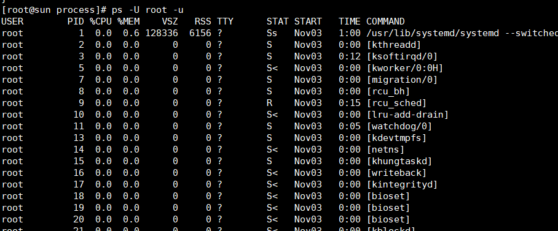
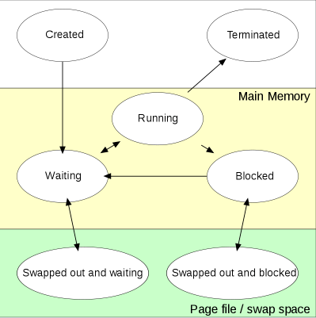

# 进程变态

使用 ``ps -U root -u``命令是用用户格式查看root用户运行的进程

**各个字段含义**

|表头|内容|
|-|-|
|USER|进程所属用户
|PID|进程ID
|%CPU|CPU 占用百分比
|%MEM| 内存占用百分比
|ADDR|进程内存地址
|VSZ|	虚拟内存
|RSS|	驻留集大小
|TT or TTY	|关联的终端进程id
|S or STAT|	进程状态码
|START or STIME|进程开始时间
|TIME|进程执行的cpu时间
|COMMAND*|进程名称，如果有执行参数，也包括参数

进程(stat)状态说明

|符号|说明|
|-|-|
|D |不可中断的休眠。通常是IO。
|R |运行。正在运行或者在运行队列中等待。
|S |休眠。在等待某个事件，信号。
|T| 停止,进程接收到信息SIGSTOP，SIGSTP，SIGTIN，SIGTOU信号。
|W |paging，在2.6之后不用。
|X |死掉的进程，不应该出现。
|Z| 僵死进程
|<| 高优先级
|N| 低优先级
|L| 有pages在内存中locked。用于实时或者自定义IO。
|s| 进程领导者，其有子进程。
|l| 多线程
|+| 位于前台进程组

下面一张图来源于wiki，说明了进程在创建到退出过程中可能会有的状态。

这个过程中需要说明几点：

>只有从等待状态（waiting)到运行态（running)，waiting进程和running进程的区别在于有没有cpu资源正在使用，
>
>上面的高优先级和低优先级会影响到从waiting到running的竞争
>
>上面表格中的休眠对应的这里的阻塞态(blocked)，
>
>僵尸进程和停止对应的这里的停止状态（terminated)
>
>两个交换（swapped out）,这个主要由于系统内存不足，通过调度策略将不正在运行的进程资源调出内存，腾出更多空间给运行的进程 

##总结

这里理论性太强，等遇到后面的实例操作不断来巩固这里的知识。