#git与远程仓库连接

我这里将以与github上的仓库为例，将本地仓库与远程仓库进行连接，如果没有github的账户，请注册一个，[传送门](https://github.com/)

##创建远程仓库

1  登陆github，在网站右角上点击+，选择 new repository,

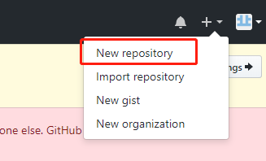

2 写入仓库的名称，勾选``Initialize this repository with a README``这项，点击创建

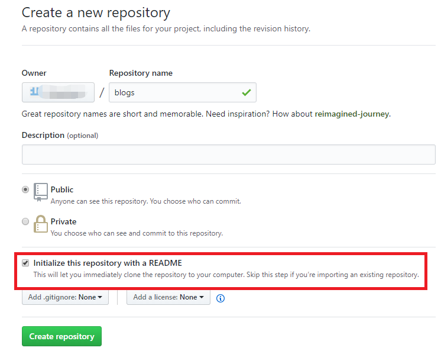

到这里，我们就创建好了一个远程仓库；接下我们将与本地仓库绑定，

##call远程仓库

1 当我们要访问远程仓库，需要自报家名，首先需要配置本地仓库的名称和email；使用config命令；

	git config --global user.name "名字"
	git config --global user.email "email"

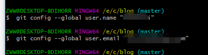

2 使用ssh服务，进行安全通信，在命令行中输入`` ssh-keygen -t rsa``，遇到输入行全部按enter键，不用问为什么，这样可靠。

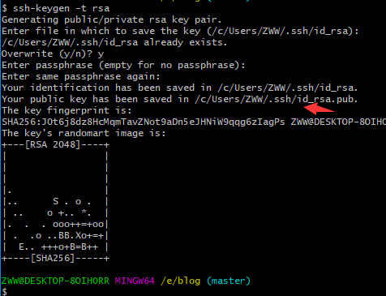

上面图片箭头所指的就是我们公钥存储的位置，我们使用cat命令获得公钥，当然你也可以直接进入这个目录获取：

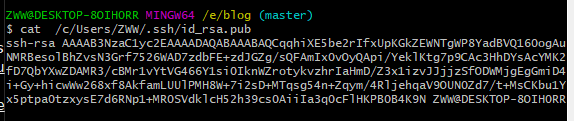

3复制获得的公钥，进入github网站，点击网站右上角的头像，选择setting，如图

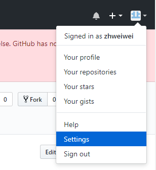

4 进入setting界面，选择SSH and GPG keys，创建新的SSH keys,

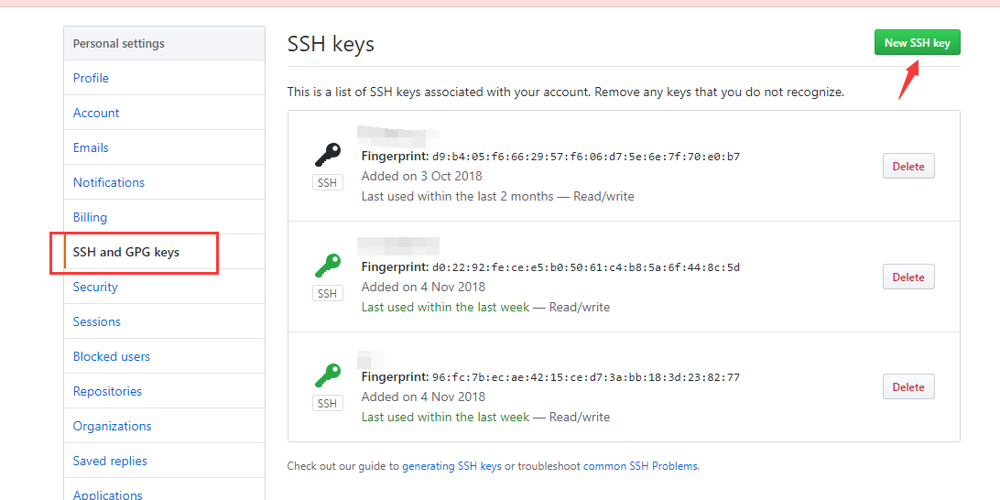

粘贴我们刚刚复制的公钥，点击添加

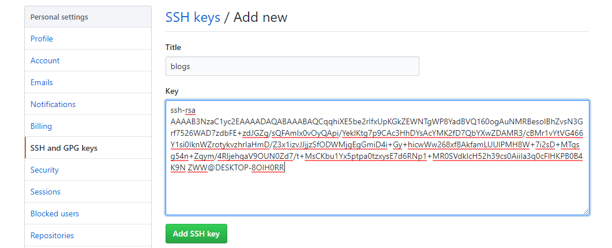

5 回到git控制台，输入`` ssh -T git@github.com``，测试是否添加正确，如图显示能够正常连接；

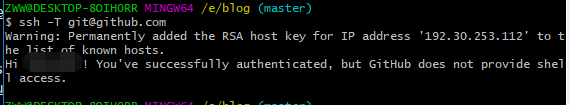

至此。我们本地仓库与远程仓库通信算是解决了，

##关联远程仓库

还记得我们刚刚建的一个远程仓库吗，现在那个远程仓库终于派上了用场，

我们在本地添加一个远程仓库，首先，我们进入远程仓库的界面，复制远程仓库路径,这里需要是clone with ssh模式，如果不是，可以点击use ssh

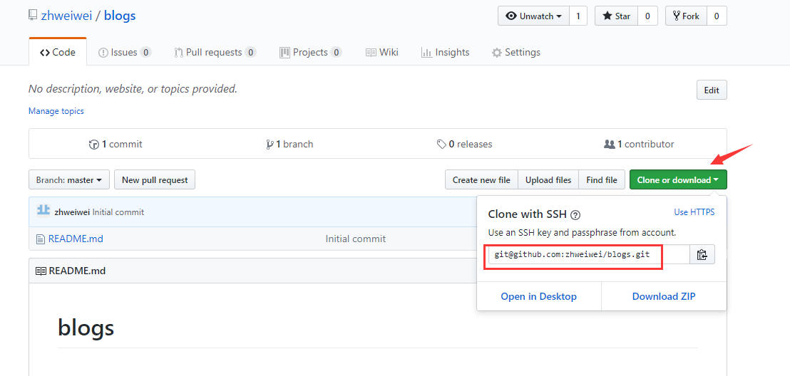
##git remote

我们回到git 操作台，输入``git remote add origin git@github.com:zhweiwei/blogs.git``,我来解释下这个remote命令，就是在本地添加一个远程模板库，取名origin,从linux命令来说，没有反应就是最好的反应，所以下面没有反应就是表示成功了，

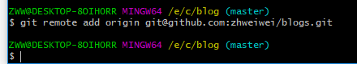

##git pull

还记得我们刚刚创建仓库勾选了一个复选框吗，要是不记得了可以看看上面的图片，由于我们这是第一次与远程合并，首先需要将远程的有的本地没有的合并到本地来，执行``git pull origin master`` ,将远程仓库文件同步到本地。大家对master是不是有点疑惑，当我们创建本地仓库时，git默认给我们创建了一个分支，取名master,执行结果如下表示pull成功了，此时，文件夹会多一个README.md文件。

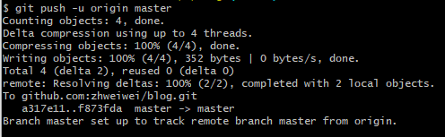

可能执行结果会出现下面的图片。最后一行``fatal: refusing to merge unrelated histories``说明我们执行的pull没有成功，这是因为 两个 根本不相干的 git 库， 一个是本地库， 一个是远端库， 然后本地要去推送到远端， 远端觉得这个本地库跟自己不相干， 所以告知无法合并。

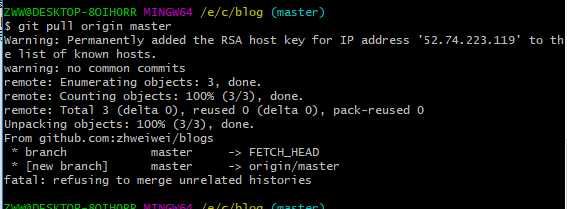

我们需要使用``git pull origin master --allow-unrelated-histories``命令执行。结果如下,此时文件中会多一个README.md文件。

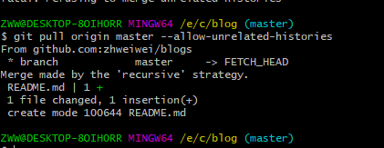

##git push

如果我们不执行上面的pull命令，直接执行push命令，就会报错。当我们执行完pull后，还记得我们仓库中有两个hello文件不，接下来，我们将这两个文件上传到远程仓库中，使用push命令,在命令行执行``git push -u origin master``，在执行过程中可能会出现下面图1的提示，很正常，这是github需要你去确认下对方的邮箱，去github上确认下即可。

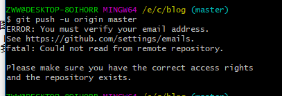

.确认完邮箱之后，再次执行上面push命令，执行结果如下。在push命令中加``-u``的好处是下次执行push命令时，就只需要执行``git push``即可。

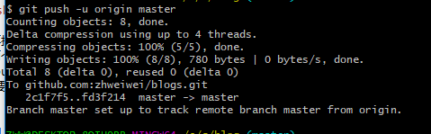

下面我在hell_utf-8文件添加了一行，然后将更新到远程仓库中的步骤，有些命令是我之前提到的，但是没有实验，乘此执行一边：
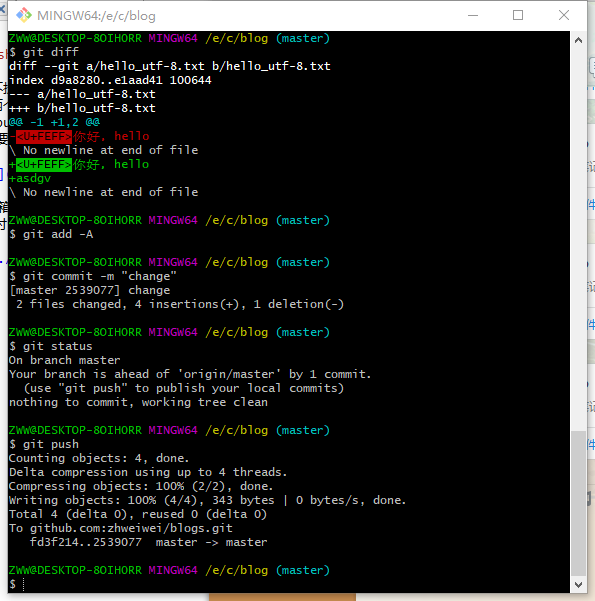