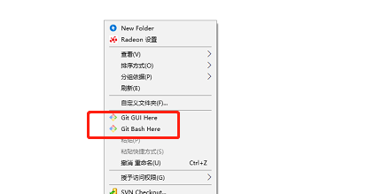
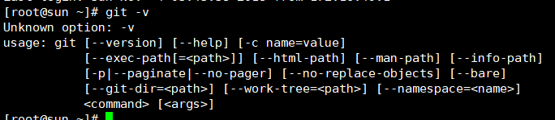

# git的安装   window篇
## window系统上的安装
下载git软件，点击[这里](https://www.git-scm.com/download/) ，下载点击安装即可；

安装完成后，鼠标右击会有下面的标识标识在window上安装成功

## linux系统上安装
centos系统上安装

>yum install git -y

ubuntu系统上安装

>apt-get install git -y

在命令行上输入``git -v``,显示下面的表示安装成功；

