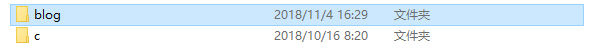
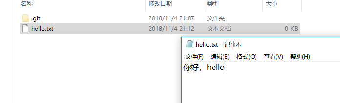
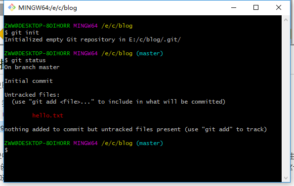
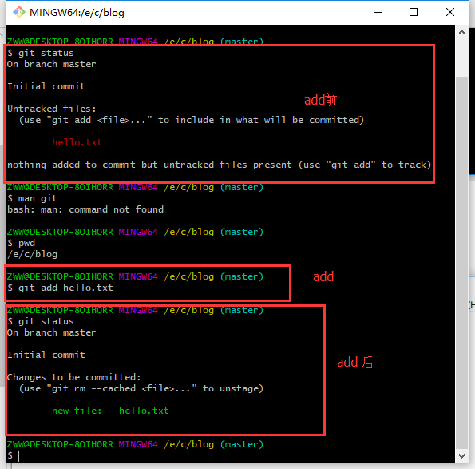
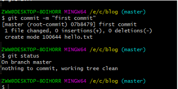
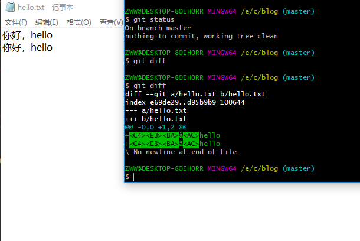
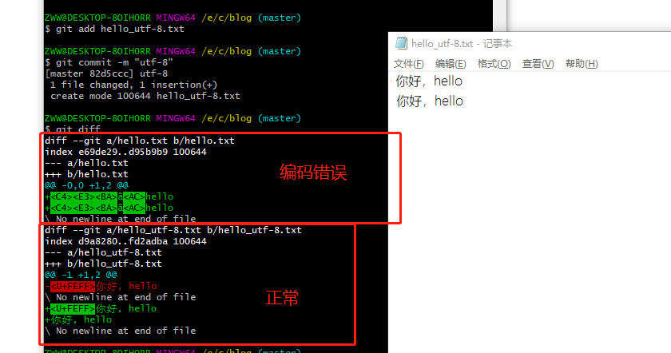
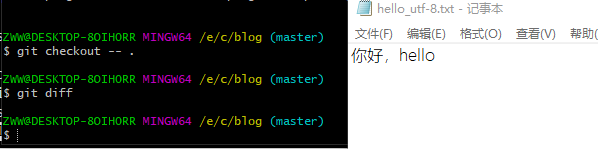

# git本地仓库操作

上一篇巴拉巴拉了一堆理论的知识，估计到这里就困了，接下来来点有意思的。

到这里，我们电脑上都应该装了git这个软件了，首先，我们新建一个目录，（在Linux系统命令是``mkdir blog``）,window就自己建了，

进入目录中，鼠标右键选择Git Bash Here来打开git操作台，git操作台上的命令和linux命令相似，这也是由于github的创始人Linus Torvalds，Linus Torvalds的另一个身份是lunix创始人，从他的名字就能看出来，这也是我今天才知道他的大名；

##git init

在操作台上执行 ``git init`` 命令初始化，初始化之后，blog文件夹里会多一个.git文件夹，这里不说文件夹内容了，有兴趣的等看完这个博客再去百度下；

接下来我们在blog文件夹中建一个hello.txt，文件内容为你好，hello!，如图

##git status

我们使用``git add hell.txt'' 将文件添加到stage状态，在添加前，我们先介绍下``git status``这个命令，status命令会提示接下来你可能需要的操作，在git操作台输入``git status'',如下图；

我来解释下显示的内容;

* on branch master 说明当前分支为master,关于分支[传送门](https://git-scm.com/book/zh/v2/Git-%E5%88%86%E6%94%AF-%E5%88%86%E6%94%AF%E7%AE%80%E4%BB%8B)
* Untracked files  没有被追踪的文件， 括号也说的很清楚
* nothing added to commit but untracked files present (use "git add" to track) 这一行说明目前还没有被添加的文件可以执行commit，同时也说明了``git add``的作用，添加文件到被追踪状态，即stage态

##git add

通过执行``git add hello.txt``将文件添加到stage态，即追踪态（tracked），对比下add前后的状态

这里对``git add -A``命令说明下，这个命令是将工作树中与本地仓库中不同的文件添加到stage态,``git add -A``是``git add --all``的简写形式；

##git commit

``git commit``是将staget态的文件提交到本地仓库中,用法为``git commit -m "这里填写提交说明"``,大家看看上面执行add之后再执行git status的输出，显示stage距上次commit有了改变（changed),在命令行中输入``git commit -m "first commit``，进行提交，显示如下,输入``git status``查看状态，没有需要提交的文件了

##git diff

git diff 命令是查看仓库和工作区的不同，当然git diff也可以查看不同分支的不同，这里就不探讨这个深。只需要知道git diff 命令是查看仓库和工作区的不同，我们首先在hello.txt 文件中再添加一行你好,hello，保存.,然后执行``git diff``，如图,

输出出现了乱码现象，这是由于我们保存文件时没有考虑到编码导致的，现在重新新建一个文件名为hello_utf-8.txt，保存时编码格式选择utf-8，重装``git add hello_utf-8.txt``和``git commit -m "utf-8"``,查看下图，修改后的编码出现了想要的结果

##git checkout 

如果有一天，你发现你工作区的文件与仓库的文件不同，希望回到仓库文件，就可以使用checkout这个命令.
``git checkout -- .``，将当前目录的文件回退到提交仓库状态,当然checkout命令还有其他用法，可以自行去整理学习;下图使用diff命令发现就没有的不同的提示，同时打开文件显示的提交的状态；

