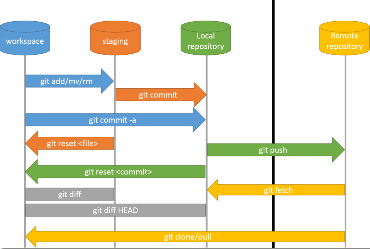

# git的命令介绍  

如何英语比较好的，自己可以在linux上执行 ``man git`` 命令就可查看关于git的所有命令

下面是关于git的部分说明，git命令格式一般都为git加命令，例如``git init``

| 命令 |说明|
|-|-|
|init|建一个空的git仓库或者重新初始化一个存在的git仓库|
|config|获得或者设置仓库或者全局变量|
|remote|管理追踪的仓库集（英文：manage set of tracked reposities）|
|help|呈现git的帮助信息|
|add|添加文章内容到stage,``git add -A`` 是将所有修改内容添加到stage中|
|commit|记录仓库文件发生的变动，用一般为``git commit -m "说明"``|
|clone|克隆一个仓库到新的目录中|
|diff|呈现两个commit 后者commit与工作树的不同|
|log| 呈现commit的日志|

下图为命令之间的关系

