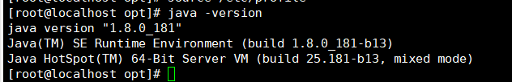
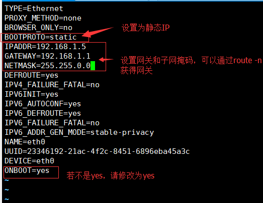
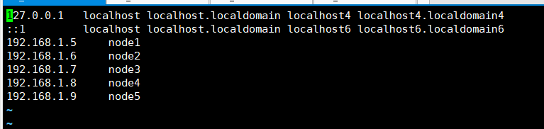

#centos7 部署hdfs
说明：接下来部署环境为cnetos 7，如果是其他版本可以会出现偏差
***
##更新源
>yum update

##安装基本工具
>yum install net-tools vim -y

##安装JDK  [下载地址](https://www.oracle.com/technetwork/java/javase/downloads/java-archive-javase8-2177648.html)
我的jdk安装包放在/opt目录下

解压->建立软连接
>tar -zxvf jdk-8u181-linux-x64.tar.gz
>ln -sf jdk1.8.0_181/ jdk

将jdk执行文件添加到环境变量，修改/etc/profile文件
>vim /etc/profile
>\#在最后文件最后添加下面内容
>export JAVA_HOME=/opt/jdk
>export PATH=.:$PATH:$JAVA_HOME/bin
>\#使修改内容生效
>source /etc/profile

验证是否安装成功
>java -version

##配置网络
配置静态ip，文件路径`/etc/sysconfig/network-scripts`中的ifcfg-eth0.

当配置完之后，使用`service network restart`重启网络，

##设置主机名
文件地址为'`/etc/hosts`,这步用于以后配置文件只需要填写主机名不用使用ip地址，方便点

配置完后可以将这个文件添加到其他主机,可以使用`scp /etc/hosts root@node2:/etc/`

##配置免密钥登陆
下面命令我是在node1上执行的
>ssh-keygen -t rsa //遇见输入的地方直接按enter键
>cat ~/.ssh/id_rsa.pub >> ~/.ssh/authorized_keys

