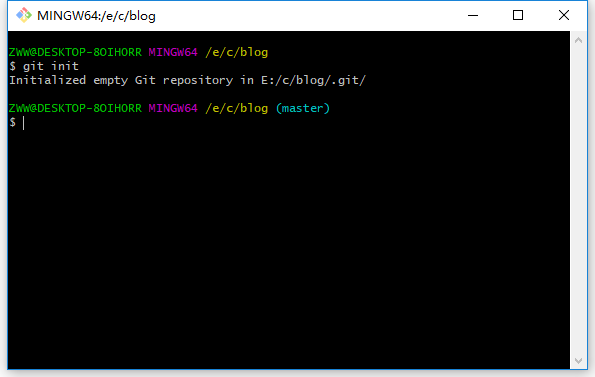

# git的相关操作   window篇
## window系统上的安装
下载git软件，点击[这里](https://www.git-scm.com/download/) ，下载点击安装即可；

## linux系统上安装
centos系统上安装

>yum install git -y

ubuntu系统上安装

>apt-get install git -y

##git 相关命令介绍
如何英语比较好的，自己可以在linux上执行 ``man git`` 命令就可查看关于git的所有命令

下面是关于git的部分说明，git命令格式一般都为git加命令，例如``git init``

| 命令 |说明|
|-|-|
|init|建一个空的git仓库或者重新初始化一个存在的git仓库|
|config|获得或者设置仓库或者全局变量|
|remote|管理追踪的仓库集（英文：manage set of tracked reposities）|
|help|呈现git的帮助信息|
|add|添加文章内容到stage,``git add -A`` 是将所有修改内容添加到stage中|
|commit|记录仓库文件发生的变动，用一般为``git commit -m "说明"``|
|clone|克隆一个仓库到新的目录中|
|diff|呈现两个commit 后者commit与工作树的不同|
|log| 呈现commit的日志|

下图为命令之间的关系

##实际操作git命令

上面巴拉巴拉了一堆理论的知识，估计到这里就困了，接下来来点有意思的。

到这里，我们电脑上都应该装了git这个软件了，首先，我们新建一个目录，（在Linux系统命令是``mkdir blog``）,window就自己建了，

进入目录中，鼠标右键选择Git Bash Here来打开git操作台，git操作台上的命令和linux命令相似，这也是由于github的创始人Linus Torvalds，Linus Torvalds的另一个身份是lunix创始人，从他的名字就能看出来，这也是我今天才知道他的大名；

在操作台上执行 ``git init`` 命令初始化，初始化之后，blog文件夹里会多一个.git文件夹，这里不说文件夹内容了，有兴趣的等看完这个博客再去百度下；

接下来我们在blog文件夹中建一个hello.txt，文件内容为你好，hello!，如图

我们使用``git add hell.txt'' 将文件添加到stage状态，在添加前，我们先介绍下``git status``这个命令，status命令会提示接下来你可能需要的操作，在git操作台输入``git status'',如下图；

我来解释下显示的内容;

* on branch master  说明当前分支为master,关于分支[传送门](https://git-scm.com/book/zh/v2/Git-%E5%88%86%E6%94%AF-%E5%88%86%E6%94%AF%E7%AE%80%E4%BB%8B)
* Untracked files  没有被追踪的文件， 括号也说的很清楚

