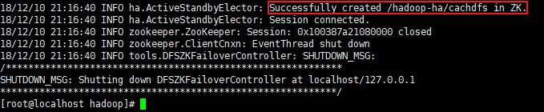
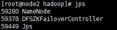
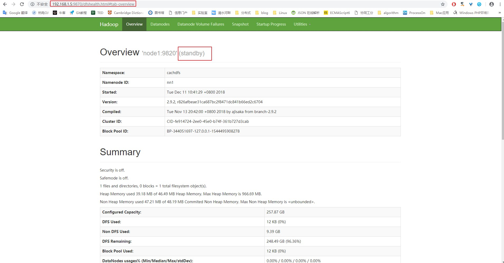
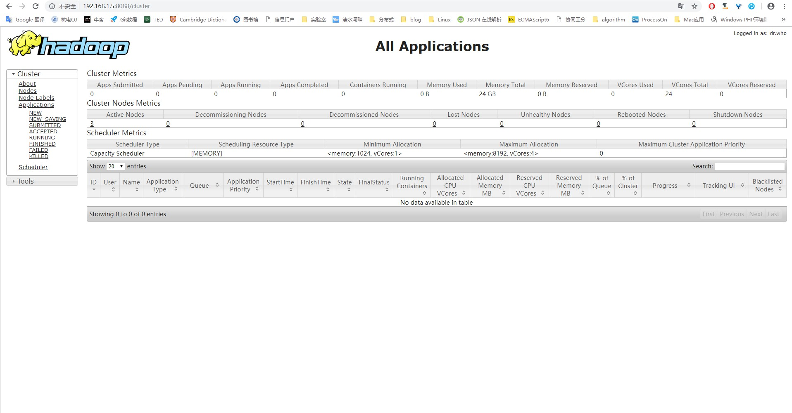

# centos7 部署hdfs
说明：接下来部署环境为centos 7，如果是其他版本可以会出现偏差
***
## 更新源
> yum update

## 安装基本工具
> yum install net-tools vim -y

## 安装JDK  [下载地址](https://www.oracle.com/technetwork/java/javase/downloads/java-archive-javase8-2177648.html)
我的jdk安装包放在/opt目录下

解压->建立软连接
> tar -zxvf jdk-8u181-linux-x64.tar.gz 
> ln -sf jdk1.8.0_181/ jdk

将jdk执行文件添加到环境变量，修改/etc/profile文件
> vim /etc/profile
> \#在最后文件最后添加下面内容  
> export JAVA_HOME=/opt/jdk 
> export PATH=.:$PATH:$JAVA_HOME/bin
>\#使修改内容生效 
> source /etc/profile

验证是否安装成功
> java -version

## 配置网络
配置静态ip，文件路径`/etc/sysconfig/network-scripts`中的ifcfg-eth0.

当配置完之后，使用`service network restart`重启网络，

## 设置主机名
文件地址为`/etc/hosts`,这步用于以后配置文件只需要填写主机名不用使用ip地址，方便点

配置完后可以将这个文件添加到其他主机,可以使用`scp /etc/hosts root@node2:/etc/`

## 配置免密钥登陆
下面命令我是在node1上执行的
> ssh-keygen -t rsa //遇见输入的地方直接按enter键 
> cat ~/.ssh/id\_rsa.pub >> ~/.ssh/authorized_keys

## 下载Hadoop  [下载地址](http://hadoop.apache.org/releases.html)
> 如果利用`wget`命令下载过慢,可选择将安装包下载到本地,然后上传到虚拟机上 

安装包放在`/opt`目录下

解压并建立软连接
> tar -zxvf hadoop-2.9.2.tar.gz 
> ln -sf hadoop-2.9.2 hadoop

## 下载Zookeeper [下载地址](https://www.apache.org/dyn/closer.cgi/zookeeper/)
> 需要安装到`数据节点`上

安装包放在`/opt`目录下

解压并建立软连接
> tar -zxvf zookeeper-3.4.12.tar.gz 
> ln -sf zookeeper-3.4.12.tar.gz zookeeper

将zookeeper执行文件添加到环境变量`/etc/profile`中
> vim /etc/profile #添加如下内容 
> export ZOOKEEPER_HOME=/opt/zookeeper 
> export PATH=.:$PATH:$ZOOKEEPER_HOME/bin 
> source /etc/profile #使环境变量生效

## 配置zookeeper集群
修改配置文件(所有`数据节点`上的zookeeper)
> cp /opt/zookeeper/conf/zoo_sample.cfg  /opt/zookeeper/conf/zoo.cfg 
> #这个时间是作为Zookeeper服务器之间或客户端与服务器之间维持
> 心跳的时间间隔 
> tickTime=2000 
> dataDir=/opt/data/zookeeper #数据存放路径 
> clientPort=2181 #客户端连接Zookeeper服务器的端口 
> #该事件为follower和leader之间的最长心跳时间.此时该参数设置
> 为5, 说明时间限制为#tickTime的5倍 
> initLimit=10 
> #该参数配置leader和follower之间发送消息, 请求和应答的最大时
> 间长度. 此时该参数设置#为2, 说明时间限制为tickTime的2倍 
> syncLimit=5 
> #主机名:心跳端口:数据端口 
> server.1=node3:2888:3888 
> server.2=node4:2888:3888 
> server.3=node5:2888:3888 

可通过
> scp /opt/zookeeper/conf/zoo.cfg node8:/opt/zookeeper/conf/zoo.cfg

修改所有`数据节点`上的配置文件

## 创建节点ID，在配置的`dataDir`路径中添加`myid`文件
> echo "1" > myid 
> #或者 
> vim myid 
> #然后在其中添加id

## 启动 zookeeper
> zkServer.sh start #在将zookeeper添加到环境变量前提下运行

## 检查是否启动成功
> jps

## 配置开机自启动Zookeeper
### 在`/etc/systemd/system`目录下创建一个启动脚本`zookeeper.service`,添加如下内容
> [Unit] 
> Description=zookeeper 
> After=syslog.target network.target 
> 
> [Service] 
> Type=forking 
> #指定zookeeper日志文件路径，也可以在zkServer.sh中定义 
> Environment=ZOO_LOG_DIR=/opt/data/zookeeper/logs 
> #指定JDK路径，也可以在zkServer.sh 中定义 
> Environment=JAVA_HOME=/opt/jdk 
> ExecStart=/opt/zookeeper/bin/zkServer.sh start 
> ExecStop=/opt/zookeeper/bin/zkServer.sh stop 
> Restart=always 
> User=root 
> Group=root 
> 
> [Install] 
> WantedBy=multi-user.target 
### 重新加载服务
> systemctl daemon-reload
### 启动Zookeeper
> systemctl start zookeeper
### 开机自启动
> systemctl enable zookeeper
### 查看Zookeeper状态
> systemctl status zookeeper

## 修改Hadoop配置
### 在`/etc/profile`文件中配置Hadoop环境变量
> #在文件末尾添加如下内容 
> export HADOOP_HOME=/opt/hadoop 
> export PATH=.:$PATH:$HADOOP_HOME/bin:$HADOOP_HOME/sbin: 
> source /etc/profile #使环境变量生效
### 修改Hadoop环境配置文件
修改hadoop-env.sh,所有节点都要修改
> vim /opt/hadoop/etc/hadoop/hadoop-env.sh 
> #设置Java环境变量,注释掉默认的JAVA_HOME 
> export JAVA_HOME=/opt/jdk 
> export HADOOP_HOME=/opt/hadoop

设计hadoop节点分布如下：
| 节点 | NN | DN | ZK | ZKFC | JN | RM | NM |
| :------: | :------: | :------: | :------: | :------: | :------: | :------: | :------: |
| node1 | 1 | | | 1| | 1 | |
| node2 | 1 | | | 1| | 1 | |
| node3 | | 1 | 1 | | 1 | | 1 |
| node4 | | 1 | 1 | | 1 | | 1 |
| node5 | | 1 | 1 | | 1 | | 1 |

* NN：NameNode
* DN：DataNode
* ZK：ZooKeeper
* ZKFC：ZK Failover Controller(ZK故障转移控制器)
* JN：JournalNode
* RM：ResourceManager
* NM：NodeManager
### 配置高可用HDFS
#### 配置hdfs-site.xml
文件在`/opt/hadoop/etc/hadoop`目录下,在xml文件的`configuration`节点添加如下内容
> <configuration>
    <property>
        <!--这里配置逻辑名称-->
        <name>dfs.nameservices</name>
        <value>cachdfs</value>
    </property>
    <property>
        <!-- 禁用权限 -->
        <name>dfs.permissions.enabled</name>
        <value>false</value>
    </property>
    <property>
        <!-- 配置namenode 的名称，多个用逗号分割  -->
        <name>dfs.ha.namenodes.cachdfs</name>
        <value>nn1,nn2</value>
    </property>
    <property>
        <!-- dfs.namenode.rpc-address.[nameservice ID].[name node ID] namenode 所在服务器名称和RPC监听端口号  -->
        <name>dfs.namenode.rpc-address.cachdfs.nn1</name>
        <value>node1:9820</value>
    </property>
    <property>
        <!-- dfs.namenode.rpc-address.[nameservice ID].[name node ID] namenode 所在服务器名称和RPC监听端口号  -->
        <name>dfs.namenode.rpc-address.cachdfs.nn2</name>
        <value>node2:9820</value>
    </property>
    <property>
        <!-- dfs.namenode.http-address.[nameservice ID].[name node ID] namenode 监听的HTTP协议端口 -->
        <name>dfs.namenode.http-address.cachdfs.nn1</name>
        <value>node1:9870</value>
    </property>
    <property>
        <!-- dfs.namenode.http-address.[nameservice ID].[name node ID] namenode 监听的HTTP协议端口 -->
        <name>dfs.namenode.http-address.cachdfs.nn2</name>
        <value>node2:9870</value>
    </property>

    <property>
        <!-- namenode 共享的编辑目录， journalnode 所在服务器名称和监听的端口 -->
        <name>dfs.namenode.shared.edits.dir</name>
        <value>qjournal://node3:8485;node4:8485;node5:8485/cachdfs</value>
    </property>

    <property>
        <!-- namenode高可用代理类 -->
        <name>dfs.client.failover.proxy.provider.cachdfs</name>
        <value>org.apache.hadoop.hdfs.server.namenode.ha.ConfiguredFailoverProxyProvider</value>
    </property>

    <property>
        <!-- 使用ssh 免密码自动登录 -->
        <name>dfs.ha.fencing.methods</name>
        <value>sshfence</value>
    </property>

    <property>
        <name>dfs.ha.fencing.ssh.private-key-files</name>
        <value>/root/.ssh/id_rsa</value>
    </property>

    <property>
        <!-- journalnode 存储数据的地方 -->
        <name>dfs.journalnode.edits.dir</name>
        <value>/home/data/journal</value>
    </property>

    <property>
        <!-- 配置namenode自动切换 -->
        <name>dfs.ha.automatic-failover.enabled</name>
        <value>true</value>
    </property>
</configuration>

#### 配置core-site.xml
文件在`/opt/hadoop/etc/hadoop`目录下,在xml文件的`configuration`节点添加如下内容
> <configuration>
    <property>
        <!-- 为Hadoop 客户端配置默认的高可用路径  -->
        <name>fs.defaultFS</name>
        <value>hdfs://cachdfs</value>
    </property>
    <property>
        <!-- Hadoop 数据存放的路径，namenode,datanode 数据存放路径都依赖本路径，不要使用 file:/ 开头，使用绝对路径即可
            namenode 默认存放路径 ：file://${hadoop.tmp.dir}/dfs/name
            datanode 默认存放路径 ：file://${hadoop.tmp.dir}/dfs/data
        -->
        <name>hadoop.tmp.dir</name>
        <value>/home/data/hadoop/</value>
    </property>

    <property>
        <!-- 指定zookeeper所在的节点 -->
        <name>ha.zookeeper.quorum</name>
        <value>node3:2181,node4:2181,node5:2181</value>
    </property>
</configuration>

#### 配置yarn-site.xml
文件在`/opt/hadoop/etc/hadoop`目录下,在xml文件的`configuration`节点添加如下内容
> <configuration>
    <property>
        <name>yarn.nodemanager.aux-services</name>
        <value>mapreduce_shuffle</value>
    </property>
    <property>
        <name>yarn.nodemanager.env-whitelist</name>
        <value>JAVA_HOME,HADOOP_COMMON_HOME,HADOOP_HDFS_HOME,HADOOP_CONF_DIR,CLASSPATH_PREPEND_DISTCACHE,HADOOP_YARN_HOME,HADOOP_MAPRED_HOME</value>
    </property>

    <property>
        <!-- 配置yarn为高可用 -->
        <name>yarn.resourcemanager.ha.enabled</name>
        <value>true</value>
    </property>
    <property>
        <!-- 集群的唯一标识 -->
        <name>yarn.resourcemanager.cluster-id</name>
        <value>cachdfs</value>
    </property>
    <property>
        <!--  ResourceManager ID -->
        <name>yarn.resourcemanager.ha.rm-ids</name>
        <value>rm1,rm2</value>
    </property>
    <property>
        <!-- 指定ResourceManager 所在的节点 -->
        <name>yarn.resourcemanager.hostname.rm1</name>
        <value>node1</value>
    </property>
    <property>
        <!-- 指定ResourceManager 所在的节点 -->
        <name>yarn.resourcemanager.hostname.rm2</name>
        <value>node2</value>
    </property>
    <property>
        <!-- 指定ResourceManager Http监听的节点 -->
        <name>yarn.resourcemanager.webapp.address.rm1</name>
        <value>node1:8088</value>
    </property>
    <property>
        <!-- 指定ResourceManager Http监听的节点 -->
        <name>yarn.resourcemanager.webapp.address.rm2</name>
        <value>node2:8088</value>
    </property>
    <property>
        <!-- 指定zookeeper所在的节点 -->
        <name>yarn.resourcemanager.zk-address</name>
        <value>node3:2181,node4:2181,node5:2181</value>
    </property>

    <property>
        <!-- 启用节点的内容和CPU自动检测，最小内存为1G -->
        <name>yarn.nodemanager.resource.detect-hardware-capabilities</name>
        <value>true</value>
    </property>
</configuration>

#### 配置mapred-site.xml
文件在`/opt/hadoop/etc/hadoop`目录下,在xml文件的`configuration`节点添加如下内容
> <configuration>
    <property>
        <name>mapreduce.framework.name</name>
        <value>yarn</value>
    </property>
</configuration>

#### 将配置文件复制到其他所有机器
> scp ./* node2:/opt/hadoop/etc/hadoop/

## 启动HDFS
### 先在`数据节点`启动Zookeeper
> zkServer.sh start
### 在其中一个`NameNode`上格式化Zookeeper
> hdfs zkfc -formatZK

如果格式化报如下错误

尝试**关闭防火墙**
> systemctl stop firewalld.service #停止firewall 
> systemctl disable firewalld.service #禁止firewall开机启动

如下图,则格式化成功

### 启动**所有JN节点**的JournalNode
> #在所有JournalNode节点中运行 
> hadoop-daemon.sh start journalnode

使用`jps`命令查看是否启动成功

### 格式化NameNode
在刚才格式化Zookeeper的节点上进行格式化
> hdfs namenode -format 
> #输出中没有`ERROR`信息表示格式化成功

### 启动NameNode
启动NameNode
> hadoop-daemon.sh start namenode

使用`jps`命令查看是否启动成功

在**其他NameNode**上同步,此处配置为高可用方式配置
> #在其他NameNode上运行 
> hdfs namenode -bootstrapStandby

### 配置DataNode
在`所有节点`的`/opt/hadoop/etc/hadoop`目录中修改文件`slaves`
> node3 
> node4 
> node5

将这三个Zookeeper节点添加为DataNode节点

### 启动hdfs
> start-dfs.sh

使用`jps`命令查看每个节点的状态

- **node1**

- **node2**

- **node3**

- **node4**

- **node5**

通过浏览器访问两个NameNode节点可查看信息

- [点击访问node1](http://192.168.1.5:9870)

可看到`node1`的具体信息

- [点击访问node2](http://192.168.1.6:9870)

可看到`node2`的具体信息

可看到,其中一个NameNode节点处于`active`状态,另外一个NameNode处于`standby`状态
## Hadoop配置日志聚合和jobhistoryserver
### yarn-site.xml配置
添加如下配置
> <configuration> 
    <property>
        <name>yarn.log-aggregation-enable</name>
        <value>true</value>
    </property>
    <!-- 日志聚合目录 -->
    <property>
        <name>yarn.nodemanager.remote-app-log-dir</name>
        <value>/home/data/logs</value>
    </property> 
</configuration>

### mapred-site.xml配置
添加如下配置
> <configuration>
    <!-- 将JobHistory配置到node2节点上 -->
    <property>
        <name>mapreduce.jobhistory.address</name>
        <value>node2:10020</value>
    </property>
    <property>
        <name>mapreduce.jobhistory.webapp.address</name>
        <value>node2:19888</value>
    </property>
    <property>
        <name>mapreduce.jobhistory.intermediate-done-dir</name>
        <value>/mr-history/tmp</value>
    </property>
    <property>
        <name>mapreduce.jobhistory.done-dir</name>
        <value>/mr-history/done</value>
    </property>
</configuration>

### 启动yarn集群
> #在一台NameNode(master)上运行 
> start-yarn.sh 
> #yarn会自动寻找NodeManager并启动 
> #去另外三台数据节点上使用jps命令查看，如果没有NodeManager字样,则参考后面的手动启动NodeManager 
> #在另外一台NameNode上,我们需要手动去启动resourcemanager 
> yarn-daemon.sh start resourcemanager

### 启动historyserver
> #在配置文件中配置了node2为historyserver 
> #在node2中使用如下命令启动historyserver 
> mr-jobhistory-daemon.sh start historyserver

使用`jps`命令可看到ResourceManager`(node1和node2中)`和JobHistoryServer`(node2中)`字样

### 手动启动NodeManager
> #在数据节点上启动 
> yarn-daemon.sh start nodemanager

如果在启动后使用`jps`命令没有看到NodeManager(或者有,但会自动结束),且在日志中出现如下错误

则在所有节点的`yarn-site.xml`配置中添加如下内容(可能是由于Hadoop版本问题引起的默认值错误)
> <configuration>
    <property>
        <name>yarn.nodemanager.resource.cpu-vcores</name>
        <value>8</value>
    </property>
    <property>
        <name>yarn.nodemanager.resource.memory-mb</name>
        <value>8192</value>
    </property>
</configuration>

尝试再次启动NodeManager,即可看到NodeManager字样

## 简易启动
确保上节**Hadoop配置日志聚合和jobhistoryserver**中的配置文件正确填写后,可以不运行配置文件后面启动命令,直接在处于`active`的NameNode节点上运行如下命令
> #Hadoop不会停止另一台NameNode节点的ResourceManager、JobHistoryServer和Zookeeper 
> stop-all.sh 
> #重新读取配置文件启动,Hadoop会启动除了另一台NameNode节点的ResourceManager、JobHistoryServer和Zookeeper之外的所有进程 
> start-all.sh

然后在另外一台NameNode节点运行
> yarn-daemon.sh start resourcemanager

启动ResourceManager 
之后在设定JobHistoryServer的节点上运行如下命令启动JobHistoryServer
> mr-jobhistory-daemon.sh start historyserver

## 节点及系统最终状态
### 节点
- **node1**

- **node2**

- **node3**

- **node4**

- **node5**

通过浏览器访问两个NameNode节点可查看信息

- [点击访问node1](http://192.168.1.5:9870)

可看到`node1`的具体信息

- [点击访问node2](http://192.168.1.6:9870)

可看到`node2`的具体信息

可以看到,此时node1成为了active状态,而node2成为了standby状态,这是因为重启了Hadoop集群的原因，但不影响使用
### ResourceManager监听节点网页
- [点击访问resourcemanager](http://192.168.1.5:9870)[node1]
- 或[点击访问resourcemanager](http://192.168.1.6:9870)[node2]

> 只能访问某一个NameNode节点的resourcemanager

### HistoryServer监听节点网页
- [点击访问historymanager](http://192.168.1.6:19888)

> 只能访问设定了historyserver的节点

### 测试故障迁移
在处于active的NameNode上,使用`ps -ef`命令查看namenode的pid,并以`kill -9 pid`结束namenode进程,打开处于standby的节点网页(9870端口),观察是否处于active状态 
如果该节点仍然处于standby状态,说明故障迁移失败,查看该节点错误日志(路径:`/opt/hadoop/logs/hadoop-root-zkfc-node编号.log`)有如下错误(缺少fuser命令)

> #注：可以手动启动所有手动down掉的进程,如zkfc进程、resourcemanager进程等 
> #命令见文章尾部

则在NameNode节点上安装`psmisc`软件即可
> yum -y install psmisc

再次测试,如果处于active的节点down掉后，处于standby的节点网页(9870端口)处于active状态,则故障迁移成功
### 上传测试
上传文件test.txt(任意文件),此处会上传到hdfs的默认路径`/user/root`下,所以在上传之前先建立两个文件夹
> hadoop fs -mkdir /user 
> hadoop fs -mkdir /user/root

在任一`NameNode`节点上使用
>hadoop fs -put test.txt

执行上传命令,即可通过处于`active`状态`NameNode`的网址(9870端口)看到刚才所上传的文件

## 常用指令
### 查看某一个数据节点的状态是`leader`还是`follower`
- > zkServer.sh status
### 查看某一个`NameNode`状态
- > 可以通过网页端查看
- > 或者使用命令查看
    1. > hdfs haadmin -getServiceState nn1
    2. > hdfs haadmin -getServiceState nn2
### 停止整个Hadoop集群顺序
- > 停止JobHistoryServer --> 停止DFSZKFailoverController --> 停止ResourceManager(在单独启动的ResourceManager的节点上) --> 停止ResourceManager和NodeManager(在另外一台NameNode节点上使用`stop-yarn.sh`) --> 停止DataNode --> 停止NameNode --> 停止JournalNode --> 停止Zookeeper
- > 使用命令停止
    > > stop-all.sh 
    > > 然后去其他节点上使用`jps`命令查看未停止的进程,使用手动停止的方法停止,最后去数据节点停止Zookeeper
### 启动整个Hadoop集群顺序
- > 与关闭顺序相反
### 启动或停止`NameNode`
- > hadoop-daemon.sh start namenode
- > hadoop-daemon.sh stop namenode
### 启动或停止`ResourceManager`
- > yarn-daemon.sh start resourcemanager
- > yarn-daemon.sh stop resourcemanager
### 启动或停止`JobHistoryServer`
- > mr-jobhistory-daemon.sh start historyserver
- > mr-jobhistory-daemon.sh stop historyserver
### 启动或停止`Zookeeper`
- > zkServer.sh start
- > zkServer.sh stop
### 启动或停止`JournalNode`
- > hadoop-daemon.sh start journalnode
- > hadoop-daemon.sh stop journalnode
### 启动或停止`DFSZKFailoverController`
- > hadoop-daemon.sh start zkfc
- > hadoop-daemon.sh stop zkfc
### 启动或停止`DataNode`
- > hadoop-daemon.sh start datanode
- > hadoop-daemon.sh stop datanode
### 常用`HDFS`指令
- > 参考[官方文档](https://hadoop.apache.org/docs/r1.0.4/cn/hdfs_shell.html)
### 错误日志
- > 某一节点的操作日志在节点的`/opt/hadoop/logs`路径下,其日志文件的命令与操作有关,如在`node1`上进行`Namenode`操作,其日志命名格式就是`hadoop-root-namenode-node1.log`。在某一节点执行操作时,如果有错误或者异常发生,可以去此路径下寻找对应的操作日志,进行修复
### 配置文件
- > 所有节点的配置文件均一致
- > hdfs-site.xml、core-site.xml、slaves、yarn-site.xml、mapred-site.xml配置文件均参考文件夹`files`中的文件
## 传输时间测试
| 文件大小 | 写入Hadoop时间 | 从Hadoop读取时间 |
| :------: | :------: | :------:|
| 500M | 1m10s | 8s |
| 1.5G | 2m28s | 16s |
| 10G | 19m26s | 2m51s |