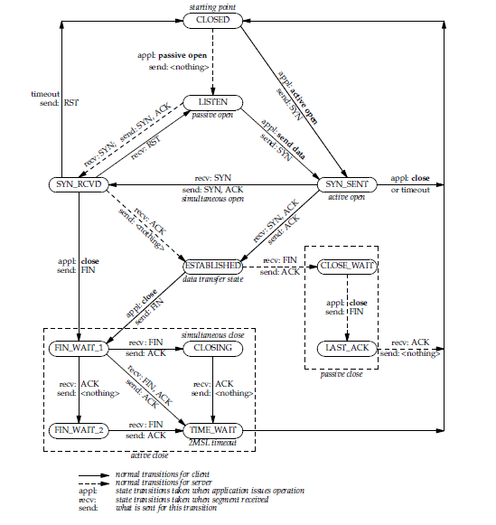

#TCP/I状态转换图
一个连接过程中，经历了一系列状态转换，这些状态有：LISENT,SYN-SENT,SYN-RECEIVED,ESTABLISHED,FIN-WAIT-1,FIN-WAIT-2,CLOSE-WAIT,LAST-ACK,TIME-WAIT.和虚拟状态CLOSED，CLOSED代表了没有连接的状态。简短的状态介绍如下：

|名称|含义|
|-|:-:|
|LISTEN|代表正在等待一个远程的连接请求
|SYN-SENT|发送了一个连接请求后等待匹配请求
|SYN-RECEIVED|收到和发送一个连接请求后等待连接请求的确认（ACK）
|ESTABLISHED|代表数据可以被发送到用户，在连接状态，正常数据可以进行传输
|FIN-WAIT-1|等待远程TCP的结束请求，
|FIN-WAIT-2|等待远程TCP的结束请求
|CLOSE-WAIT|等待本地一个断开连接的请求
|CLOSING|正在等待远程断开连接确认请求（ACK)
|LAST-ACK|等待之前发送给远程的断开连接的的确认请求
|TIME-WAIT|等待足够时间来确保远程TCP收到了关于断开连接的确认（ACK）
|CLOSED|没有连接状态

一个TCP连接过程从一个状态转化为另一个状态是对事件做出的反应，这些事件包括用户调用open,send,receive,close,abort和status；这些输入段，特别包括SYN，ACK，RST和FInd，标识和超时

