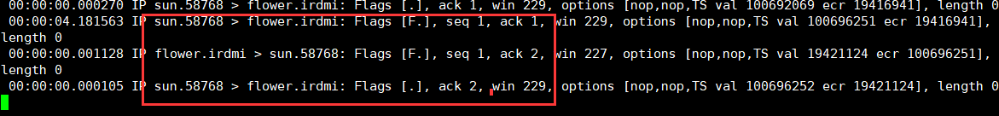
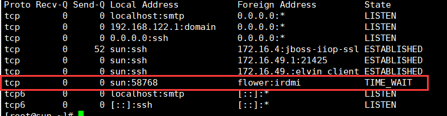
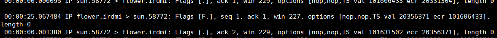
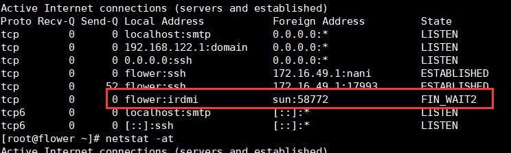
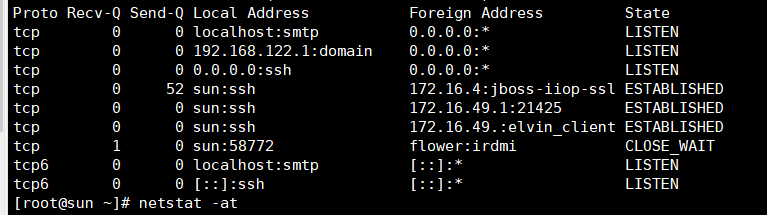
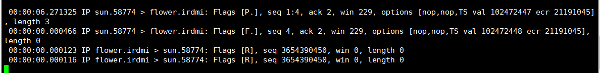

#关于client和service异常情况
##client异常情况
当client异常，进程终止时，客户端会发送fin信号到server端,同时双方都收到了ack，但是当client进程结束退出服务后，client的套接字地址（ip+port)依然占用，client与server的状态为TIME_WAIT，这是由于client主动退出的原因。下面还有server端主动退出，client端的状态就是其他状态。





当套接字地址依然占用时，套接字地址是无法绑定套接字的，也就是套接字地址处于不可用状态。当然可以通过其他套接字设置选项设置为使用。

****
##server异常情况
当server异常，进程终止时，我们看到server发送了fin信号给client，client只发送了ack给server端，server端处于FIN_WAIT2状态。





此时，client处于close_wait状态.



如果此时发送请求给server端，由于server端服务没有开启，这server端将发送rst标记给client，client将会终止服务。


我们看到当我们提交任务时，由于sock另一端早就关闭了，所以read立即返回，向server端发送FIN标记，这也是为什么server端会发送两个RST标识，一个相应push标记，一个相应FIN标记。

下面时server和client端的部分代码
```c
void doServer(int sockfd) {
	int nr, nw;
	char buf[4096];

	while(1) {
		nr = readline(sockfd, buf, 4096);
		if (nr == 0) {
			puts("peer closed");
			break;
		}
		else if (nr < 0) {
			if (errno = ECONNRESET) {
				perror("readline");
				break;
			}
			ERR_EXIT("readline");
		}

		toUpper(buf, nr);

		nw = writen(sockfd, buf, nr);
		if (nw < nr) {
			puts("short write");
		}
	}
}

void doClient(int sockfd) {
	int nr, nw;
	char buf[4096];

	while(fgets(buf, 4096, stdin)) {
		nw = writen(sockfd, buf, strlen(buf));
		if (nw < strlen(buf)) puts("short write");

		nr = readline(sockfd, buf, 4096);
		if (nr == 0) {
			puts("peer closed");
			break;
		}
		else if (nr < 0) ERR_EXIT("readline");

		write(STDOUT_FILENO, buf, nr);
	}
}


```